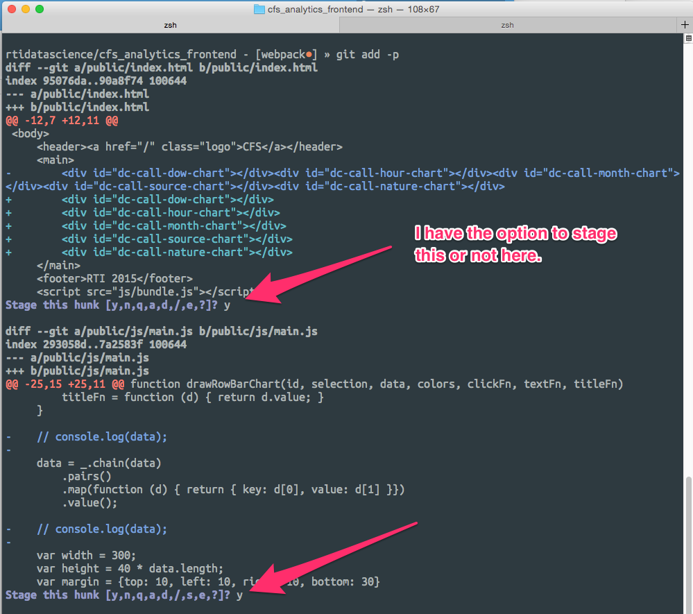

# Center for Data Science Best Practices for Git

## I. Overview

Git is a complex version control system. It is very flexible, which can be good, but also means you can use it in many different ways. This document, which is informal, recommends particular Git practices.

## II. General

### Feel free to use a GUI

Git is a command-line tool, but you can use graphical programs to work with Git repositories and have the same amount of power. On OS X, I recommend [SourceTree](https://www.sourcetreeapp.com/). Your text editor or IDE may have its own Git tools as well.

## II. Adding

### Consider using `git add --patch`

`git add --patch` will show you all your changes that are not added one by one and ask you whether to add them or not. This is an excellent way to review your code before adding and committing it.

Here's a screenshot of it in action:



### Do not use `git add -A` or `git add .`

`git add -A` will add all outstanding changes to the _index_ or [_staging area_](https://git-scm.com/book/ch1-3.html#The-Three-States). `git add .` will do the same to all changes to files in the current directory or below. While it may take long to add files individually, you are much less likely to accidentally commit something you shouldn't by doing so.

## III. Committing

### Do not use `git commit -m`

You can enter a commit message on the command line by using `git commit -m`. However, this can result in poor commit messages, as you have only one line and may not take the time to write a solid message.

### Follow established standards

[This blog post on how to write a Git commit message](http://chris.beams.io/posts/git-commit/) is a great resource. Follow its suggestions and you will have excellent commit messages and your team will be happy.

## IV. Workflow

One of the best things about Git compared to older version control systems like Subversion is how easy and cheap it is to create new branches. This can make development on new features easy and less confusing, as you don't have to commit code directly to the master branch.

The workflow we use is much like the one described [in this Gist](https://gist.github.com/jbenet/ee6c9ac48068889b0912). In short:

1. The _master_ branch is the current deployable state of your work. It should always be in a good, deployable state.
2. When you want to make a change, you create a new feature branch, push it to GitLab for comment, and then make a merge request when you're done.
3. Your branch should be frequently rebased against master to ensure a clean history.

I'll walk through the actual commands and what is happening.

```shell
git checkout master
git pull origin master
```

This is the first thing we do when we start working. We make sure we're on the master branch and we have all the latest changes.

`git pull` retrieves the latest changes from the master branch on our origin repository and merges them on top of our local master branch.

```shell
# let's branch to make changes
git checkout -b my-new-feature
```

This will create a new branch and switch you to that branch. You can name it whatever you like: I suggest naming it something that describes the feature you are working on.

Note that you should only work on one feature per branch. A branch for adding authentication and adding an XML representation to your JSON API would not be a good branch.


```shell
# go ahead, make changes now.
vim app/feature.py

# change, change, change

# commit your (incremental, atomic) changes
git add --patch
git commit
```

Breaking your changes into multiple commits is a good idea. You want each commit to be one thing you've done. That doesn't mean one line of code, but one part of your feature. If, for example, I'm reformatting some code, I wouldn't want to mix that up with changes adding a new chart.

Note that I _did not_ use the `-m` flag with `git commit` to add a message. Good git commit messages don't fit on one line easily. See ["How to Write a Git Commit Message"](http://chris.beams.io/posts/git-commit/) for more information. ["5 Useful Tips for a Better Commit Message"](https://robots.thoughtbot.com/5-useful-tips-for-a-better-commit-message) has some good thoughts on what should go in your message.


```shell
# keep abreast of other changes to master.
# rebasing keeps our code working, merging easy, and history clean.
git fetch origin
git merge origin/master
```

The above is a necessity to do often. Other changes will get merged into master while you work. This lets us bring those changes into our branch. It also may result in merge conflicts if someone's changed the same line of code that you have. That is ok -- merge conflicts happen, and better to happen here than when you eventually merge back into master.

```shell
# push your branch for discussion (pull-request)
# optional: you might do this many times as you develop.
git push origin my-new-feature
```

When you're done with your branch, push it to origin. You can do this any time you want if you want feedback, but you'll want to do it one last time when you're ready to merge.

Finally, you want to make a pull request. When you push your branch the first time, GitLab will give you a URL to make your pull request. If you're pushing more than once, you'll have to go to your repo on GitLab to find the link to make a pull request.

Choose the branch you want to pull from into master, and pick one or more people you'd like to review the branch. (If you're working on a project by yourself, you may not have anyone. It'd be good to get into the habit of someone else looking at your code, though.) Create the pull request, and you're done!

At this point, the other people on your project will look at your code and comment. In the past, I've worked where someone else on your project had to look at your code and merge it. Your project may do it differently.

## TODO

* .gitignore
* Best Testing Practices